<p align="center">
  
  
  
   
 </p>
<h1 align="center" style="margin: 30px 0 30px; font-weight: bold;">Lacus v1.0.0</h1>
<h4 align="center">基于 SpringBoot + Vue3前后端分离的开源大数据平台项目</h4>
<p align="center">
</p>

## 平台简介

- Lacus是一个开源大数据平台项目，致力于让数据同步变得更简单、好用。基础框架使用的是若依，感谢若依及其他开源作者。
- 如果你厌烦了每天大量的数据接入工作，不想把大把的时间放在数据接入中，那么这个项目很可能值得你去花点时间研究一下。
- 如果你热爱开源，喜欢折腾，不想把业余时间浪费在刷抖音或者其他无用事情上，并且对大数据感兴趣，欢迎加入这个项目，或者联系作者加入相关讨论群，交流大数据架构及开发技术。
## 如何使用
### 一、系统截图
- 登录界面，若依系统内置菜单

- 系统管理，若依系统内置菜单

- 系统监控，若依系统内置菜单
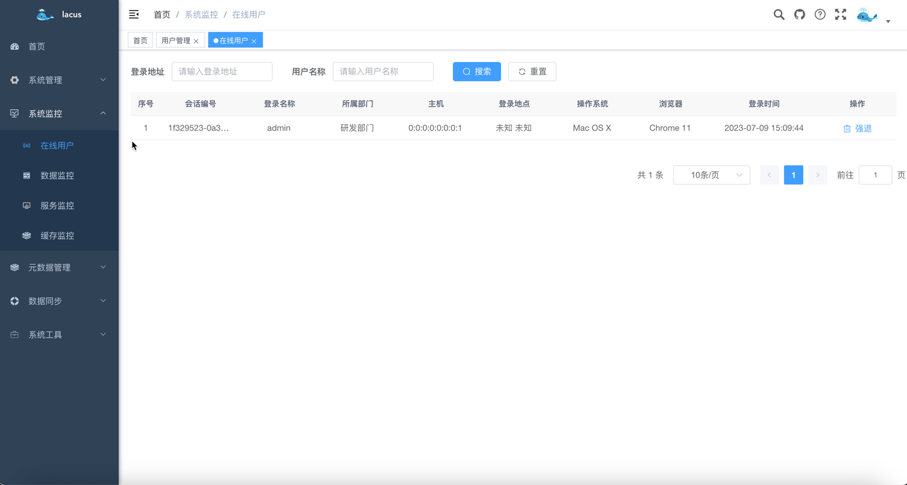
- 系统接口
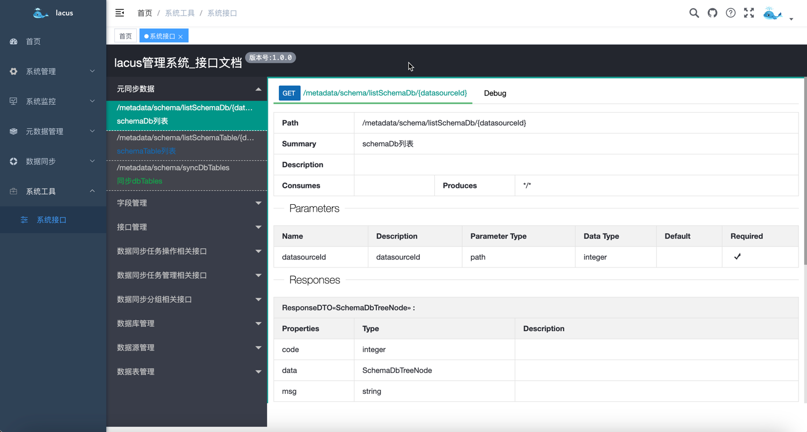
- 元数据管理-数据源管理列表
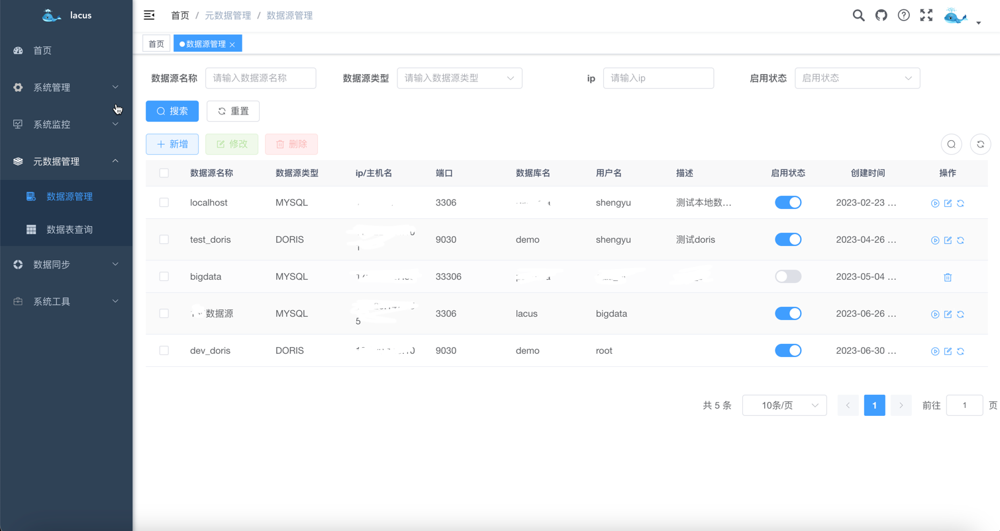
- 元数据管理-新增数据源
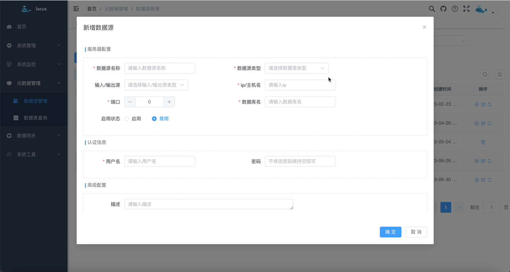
- 元数据管理-数据表查询列表
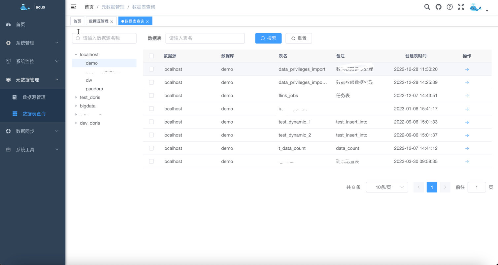
- 元数据管理-数据表详情
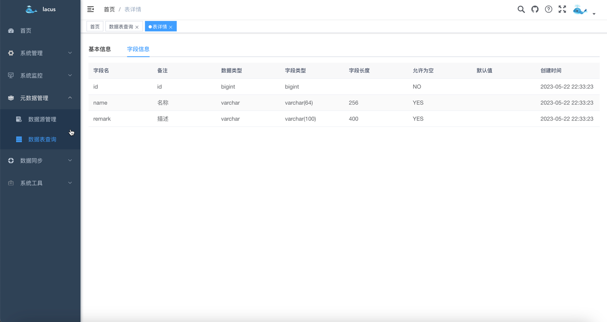
- 数据同步-任务分组管理列表
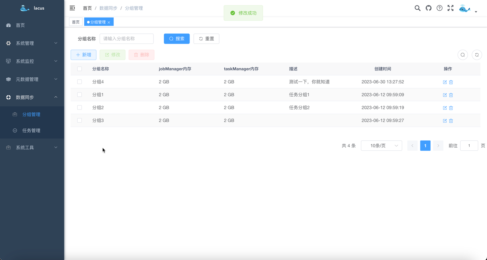
- 数据同步-任务管理列表
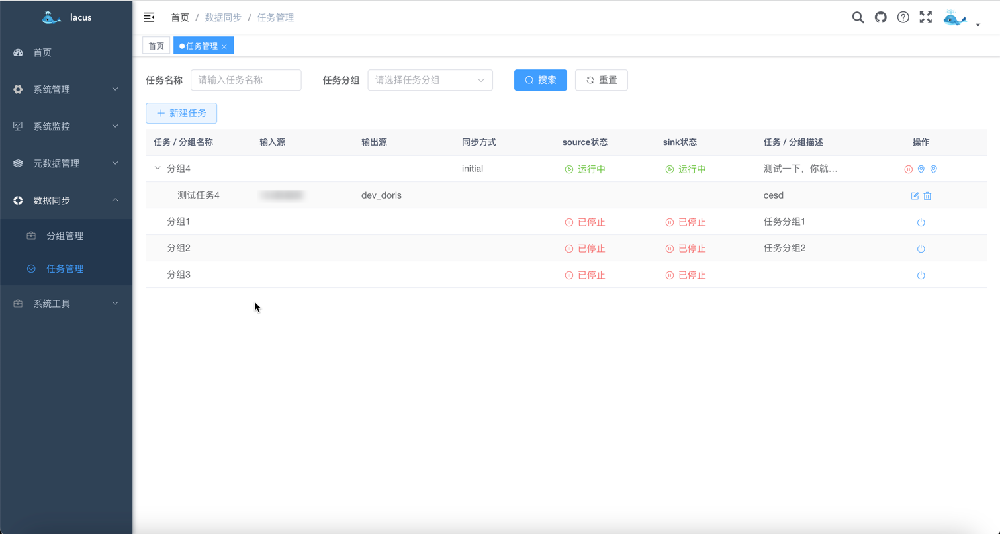
- 数据同步-接入任务启动

- 数据同步-输入源配置
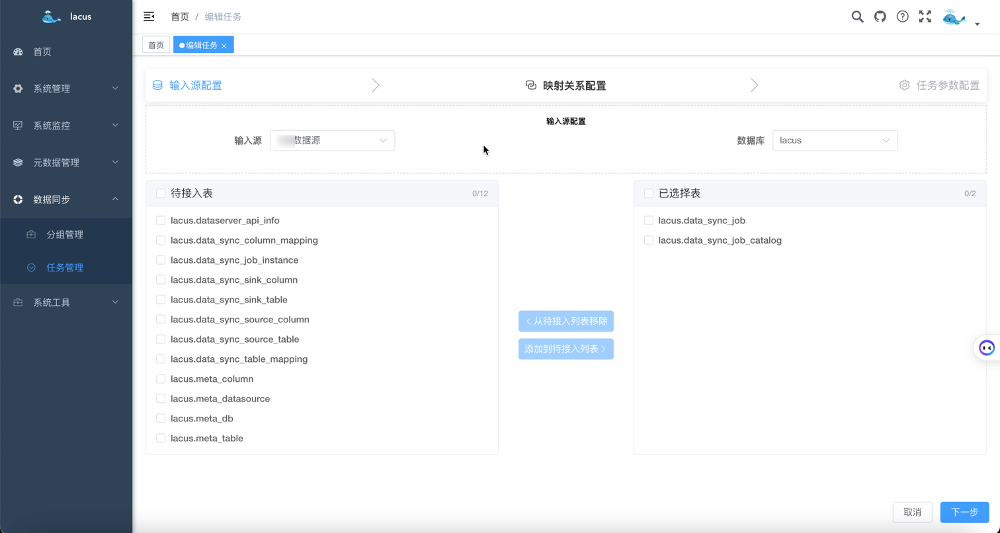
- 数据同步-表映射关系配置
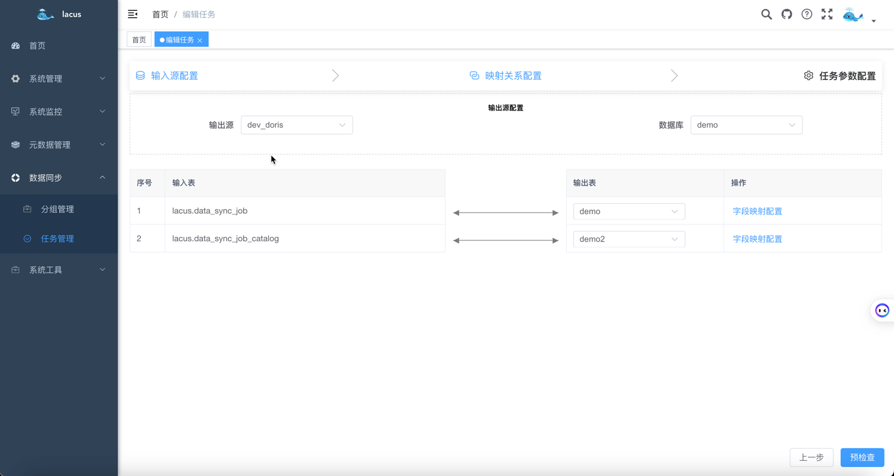
- 数据同步-字段映射关系配置

- 数据同步-任务参数配置
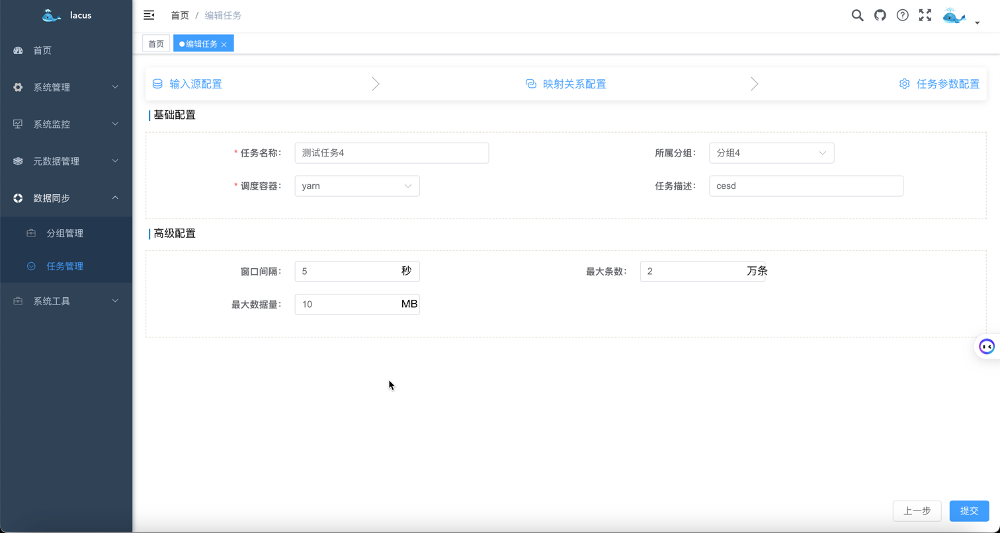
### 二、开发环境

- JDK
- Mysql
- Redis
- kafka
- flink
- flinkCDC
- yarn
- hadoop

### 三、技术栈

| 技术                | 说明                  | 版本     |
|-------------------|---------------------|--------|
| `springboot`      | Java web 项目必备框架     | 2.7    |
| `druid`           | alibaba数据库连接池       | 1.2.8  |
| `mybatis-plus`    | 数据库框架               | 3.5.2  |
| `kafka`           | 用来做数据缓冲和解耦          | 2.1.1  |
| `flink`           | flink项目必备           | 1.13.5 |
| `mysql-flink-cdc` | mysql cdc connector | 1.3.0  |
| `yarn`            | 资源调度框架              | 1.13.5 |
| `hadoop`          | 主要提供hdfs存储          | 1.13.5 |
| `apache doris`    | MPP数据库              | 1.2.5  |

### 四、启动说明

#### 1. 前置准备

- 项目代码下载
```
前端项目代码：git clone https://github.com/eyesmoons/lacus
后端项目代码：git clone https://github.com/eyesmoons/lacus-ui
```
- 安装 Mysql
- 安装 Redis
- 安装 kafka
- 安装 hadoop
#### 2. flink 资源准备
- hdfs 中上传`flink 1.13.5 `所需的jar包，目录为：`flinkCDC/flink/libs`；
- flink配置文件目录：`flinkCDC/flink/conf`；
- flink 任务所需的 jar 包目录为：`flinkCDC/flink/jobs/flink-jobs.jar`，此 jar 包由`lacus-job`项目打包而来
目录结构如下所示。

**如果嫌麻烦，不想一个一个的去寻找相关 jar 包，我将 flink 1.13.5 所有资源及配置文件放到了我的百度网盘中了。**

**微信关注"毛毛小妖的笔记"公众号，公众号回复关键字"lacus"，即可获得专属网盘链接和密码。**

#### 3. 后端启动
```
- 生成所需的数据库表
找到后端项目根目录下的 sql 目录中的 lacus.sql 脚本文件，导入到你新建的数据库中。

- 修改配置文件：application-dev.yml 
在 lacus-core 模块下，找到 resource 目录下的 application-dev.yml 文件，
配置数据库以及 Redis 的 地址、端口、账号密码；
配置 flink、kafka 等信息。

- 修改配置文件：flink-common.yml
在 lacus-common 模块下，找到 flink-common.yml 文件，
配置 flink、kafka 等信息，由于是静态类，无法通过值注入办法解决，暂时在 flink-common.yml 中进行配置

- 项目编译
在根目录执行 mvn install

- 启动项目
找到lacus-admin模块中的 LacusApplication 启动类，直接启动即可。

```
#### 4. 前端启动
```
- npm install
- npm run dev
```

> 对于想要尝试全栈项目的前端人员，这边提供更简便的后端启动方式，无需配置 Mysql 和 Redis 直接启动
#### 5. 无Mysql/Redis 后端启动
```
- 找到agilboot-admin模块下的resource文件中的application.yml文件

- 配置以下两个值
spring.profiles.active: basic,dev
改为
spring.profiles.active: basic,test

lacus.embedded.mysql: false
lacus.embedded.redis: false
改为
lacus.embedded.mysql: true
lacus.embedded.redis: true

- 找到lacus-admin模块中的LacusApplication启动类，直接启动即可
```
## 系统功能

| 功能     | 描述                 |
|--------|--------------------|
| 元数据模块  | 根据源库表管理所有元数据信息     |
| 数据服务模块 | 通过API接口,对外提供获取数据能力 |
| 数据同步模块 | 通过可视化配置，一键部署接入任务   |
| 数据质量模块 | 敬请期待...            |

## 项目结构

``` 
lacus
├── lacus-admin -- 管理后台接口模块
│
├── lacus-common -- 公共模块
│
├── lacus-core -- 核心基础模块
│
├── lacus-domain -- 业务模块
├    ├── user -- 用户模块（举例）
├         ├── command -- 命令参数接收模型（命令）
├         ├── dto -- 返回数据类
├         ├── model -- 领域模型类
├         ├── query -- 查询参数模型（查询）
│         ├────── UserApplicationService -- 应用服务（事务层，操作领域模型类完成业务逻辑）
├── lacus-job -- flink任务中心，单独模块
├── lacus-dao -- 数据映射模块（仅包含数据相关逻辑）
├    ├── entiy -- 实体类
├    ├── enums -- 数据相关枚举
├    ├── mapper -- DAO
├    ├── query -- 封装查询对象
├    ├── result -- 封装多表查询对象
└──  └── service -- 服务层
```

## 注意事项
- IDEA会自动将.properties文件的编码设置为ISO-8859-1,请在Settings > Editor > File Encodings > Properties Files > 设置为UTF-8
- 如需要生成新的表，请使用CodeGenerator类进行生成。
  - 填入数据库地址，账号密码，库名。然后填入所需的表名执行代码即可。

欢迎关注以下公众号，留言或公众号回复"交流"加入技术交流群，一起学习。
